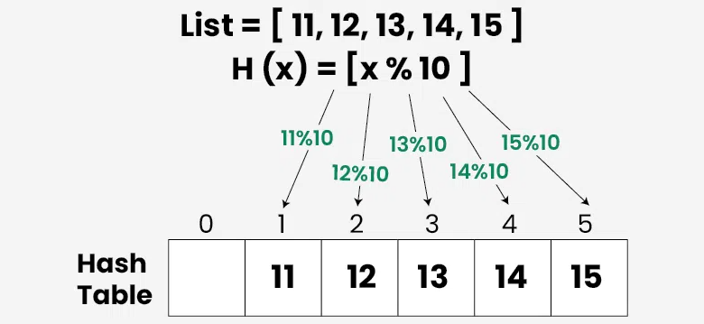
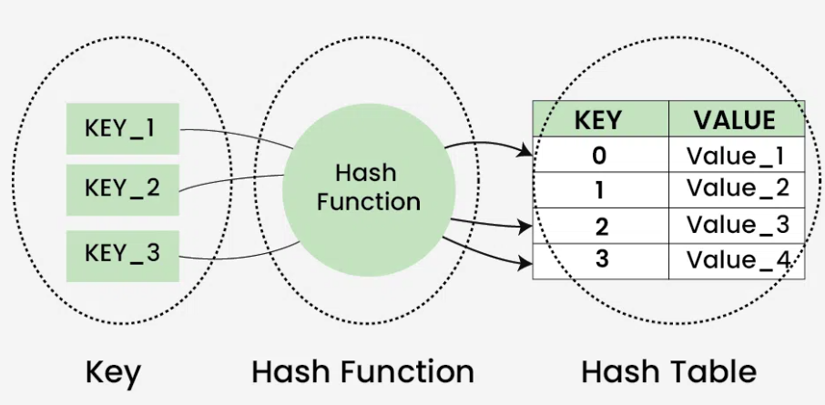

# Giới thiệu về hàm băm

- Hàm băm (`Hashing`) đề cập đến quá trình tạo ra một đầu ra có kích thước nhỏ (có thể được sử dụng làm chỉ mục trong bảng) từ một đầu vào thường có kích thước lớn và thay đổi. Hàm băm sử dụng các công thức toán học được gọi là hàm băm để thực hiện phép biến đổi. Kỹ thuật này xác định một chỉ mục hoặc vị trí để lưu trữ một mục trong cấu trúc dữ liệu được gọi là bảng băm (Hash Table).



# Tổng quan về Cấu trúc dữ liệu Hashing ( hàm băm)

- Đây là một trong những cấu trúc dữ liệu được sử dụng rộng rãi nhất sau mảng.
- Nó chủ yếu hỗ trợ tìm kiếm, chèn và xóa trong thời gian O(1) trung bình, hiệu quả hơn các cấu trúc dữ liệu phổ biến khác như mảng, danh sách liên kết và cây tìm kiếm nhị phân tự cân bằng .
- Chúng ta sử dụng hàm băm cho từ điển, đếm tần suất, duy trì dữ liệu để truy cập nhanh bằng khóa, v.v.
- Các ứng dụng thực tế bao gồm lập chỉ mục cơ sở dữ liệu, mật mã học, bộ nhớ đệm, bảng ký hiệu và từ điển.
- Có hai dạng chính của hàm băm thường được triển khai trong các ngôn ngữ lập trình.
    - Tập hợp băm (Hash Set ): Tập hợp các khóa duy nhất (Được triển khai dưới dạng Set trong Python).
    - Bản đồ băm (Hash Map ): Tập hợp các cặp khóa-giá trị với các khóa là duy nhất (Được triển khai dưới dạng dictionary trong Python).


# Các thành phần của hàm băm
- Hàm băm về cơ bản gồm ba thành phần:

    - `Khóa` : Khóa có thể là bất kỳ chuỗi ký tự hoặc số nguyên nào được đưa vào làm đầu vào cho hàm băm - kỹ thuật xác định chỉ mục hoặc vị trí lưu trữ của một mục trong cấu trúc dữ liệu.
    - `Hàm băm` : Nhận khóa đầu vào và trả về chỉ mục của một phần tử trong một mảng được gọi là bảng băm. Chỉ mục này được gọi là chỉ mục băm .
    - `Bảng băm` : Bảng băm thường là một mảng các danh sách. Nó lưu trữ các giá trị tương ứng với các khóa. Bảng băm lưu trữ dữ liệu theo cách liên kết trong một mảng, trong đó mỗi giá trị dữ liệu có chỉ mục duy nhất của riêng nó.

    


# Cơ chế băm (Hashing) hoạt động như thế nào?

Giả sử chúng ta có một tập hợp các chuỗi `{"ab", "cd", "efg"}` và muốn lưu trữ chúng trong một bảng băm (Hash Table).

- **Bước 1 (Ý tưởng hàm băm):** Hàm băm (một công thức toán học) được sử dụng để tính toán giá trị băm (*hash value*), đóng vai trò là chỉ mục (*index*) của cấu trúc dữ liệu nơi phần tử sẽ được lưu trữ.
- **Bước 2 (Quy ước giá trị ký tự):** Ta gán giá trị số cho từng ký tự trong bảng chữ cái:
  - `'a' = 1`
  - `'b' = 2`
  - `'c' = 3`
  - `'d' = 4`
  - `'e' = 5`, `'f' = 6`, `'g' = 7`, ... (tương tự cho các ký tự còn lại).
- **Bước 3 (Tính tổng giá trị của chuỗi):** Giá trị số đại diện được tính bằng cách cộng giá trị của tất cả các ký tự trong chuỗi:
  - `"ab"`: $1 + 2 = 3$
  - `"cd"`: $3 + 4 = 7$
  - `"efg"`: $5 + 6 + 7 = 18$
- **Bước 4 (Áp dụng hàm băm modulo kích thước bảng):** Giả sử bảng băm có kích thước là **7** (các chỉ mục từ `0` đến `6`) để lưu trữ các chuỗi này.  
  Hàm băm được sử dụng là:
  $$\text{Chỉ mục (Index)} = \text{Tổng giá trị các ký tự} \pmod{\text{Kích thước bảng}}$$
  Tức là: `vị_trí = tổng(chuỗi) % 7`.
- **Bước 5 (Xác định vị trí lưu trữ):**
  - `"ab"`: $3 \pmod 7 = 3 \implies$ Lưu tại vị trí **3**.
  - `"cd"`: $7 \pmod 7 = 0 \implies$ Lưu tại vị trí **0**.
  - `"efg"`: $18 \pmod 7 = 4 \implies$ Lưu tại vị trí **4**.

**Code minh họa bằng Python:**
```python
TABLE_SIZE = 7

# Hàm băm xác định vị trí lưu trữ (index) theo quy ước 'a'=1, 'b'=2,...
def hash_func(key):
    # ham ord() la ham tra ve gia tri ASCII cua mot ky tu
    # ham sum() la ham tinh tong cac phan tu trong mot danh sach
    return sum(ord(c) - ord('a') + 1 for c in key) % TABLE_SIZE

# Khởi tạo bảng băm với các ô trống (None)
hash_table = [None] * TABLE_SIZE

# Danh sách các chuỗi cần lưu trữ
keys = ["ab", "cd", "efg"]

# Băm và lưu từng phần tử vào vị trí tương ứng trong bảng băm
for key in keys:
    index = hash_func(key)
    hash_table[index] = key

print("Bảng băm sau khi lưu:", hash_table)
# Kết quả: ['cd', None, None, 'ab', 'efg', None, None]
```

**Minh họa bảng băm sau khi lưu trữ:**

| Chỉ mục (Index) | Giá trị lưu trữ (Value) |
| :---: | :---: |
| **0** | `"cd"` |
| **1** | *(trống)* |
| **2** | *(trống)* |
| **3** | `"ab"` |
| **4** | `"efg"` |
| **5** | *(trống)* |
| **6** | *(trống)* |